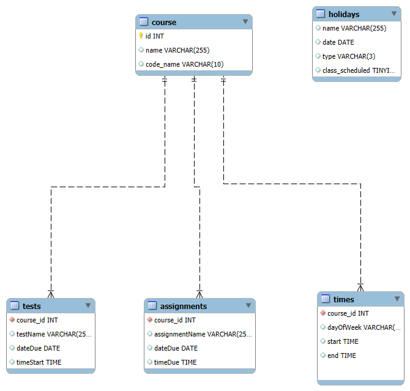
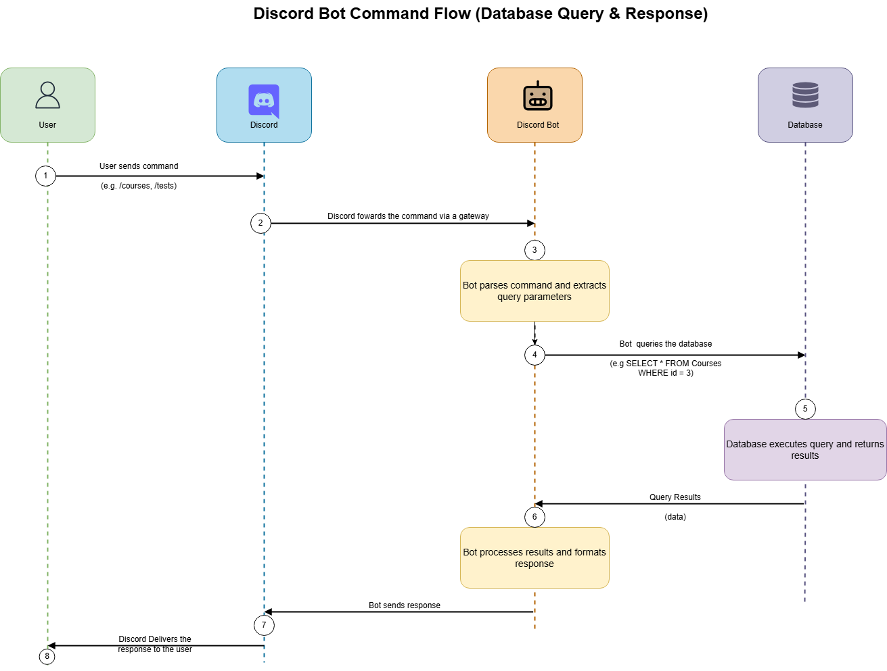

# Noisiv-Discordbot

Noisiv, which is "vision" spelled backward (could be more creative but naming things is quite challenging), is a Discord bot built as a practical application of concepts learned in my First Semester at NSCC. This bot is designed to assist with class-related remainders and notifications.

The project is progressing steadily, and the long-term goal is to modularize Noisiv, making it a versatile and standalone bot that could be utilized across multiple servers, not just for our class.

# Database Schema

# Process Diagram

# Concepts Applied
1. Database Design and Normalization
2. Logic in programming
3. Server and Network Configuration
4. Version Control

# Uses
* Python 3.12
  * Discord.py 2.4 - open source discord API for python
* MySQL